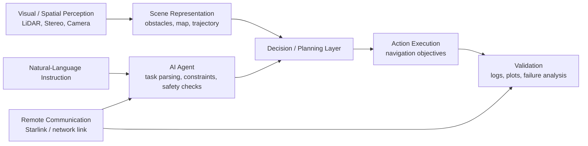

# Computer Vision, Autonomous Systems and AI-Agent Portfolio

This repository presents selected computer vision, autonomous systems and AI-agent-related projects by **Yuanyuan Tao (Alec)**, MSc Electronic Engineering candidate at Durham University.

It is prepared as a professional project portfolio for PhD applications in areas such as:

- Computer Vision
- Vision-Language-Action (VLA) Models
- Autonomous Driving / Autonomous Systems
- LiDAR and Stereo Perception
- AI-Agent-Assisted Robotics
- Multimodal Sensing and Real-World System Validation

> **Note on availability:** Some code, datasets and hardware details are not fully public because the MSc dissertation is ongoing and parts of the work involve project confidentiality. This repository therefore provides project summaries, technical scope, representative templates, synthetic-data demonstrations, and reproducible components where possible.

---

## Featured Projects

| Project | Main relevance | Status |
|---|---|---|
| [AI-Agent-Assisted Autonomous UAV using LiDAR, Stereo Vision and Starlink](./projects/01-ai-agent-assisted-autonomous-uav/) | Language-conditioned autonomous systems, perception-to-action reasoning, LiDAR/stereo sensing, communication-aware deployment | Ongoing MSc dissertation |
| [Image and Audio Deep Learning Workflows](./projects/02-image-audio-deep-learning-workflows/) | Data pipelines, model training/evaluation, multimodal learning preparation, error analysis | Coursework / project work |
| [SLAM and Perception Visualization Debugging Tools](./projects/03-slam-perception-visualization-debugging-tools/) | Trajectory plotting, timing diagnostics, sensor-fusion debugging, safety-critical perception validation | Research-supporting workflow |

---

## Positioning for VLA / Autonomous Driving Research

My current research direction is motivated by the same high-level structure that appears in Vision-Language-Action systems:

The repository is designed to show my preparation for doctoral research in VLA, autonomous driving perception and planning, and real-world AI system validation.

---

## Technical Skills Demonstrated

- Python-based data analysis and visualization
- C/C++ and embedded-development mindset
- MATLAB basics and engineering data analysis
- LiDAR and stereo sensing concepts
- SLAM-style debugging and trajectory validation
- AI-agent-assisted mission logic
- Real-time visualization and data logging
- Communication-aware system integration
- Hardware/software co-design
- Experimental validation and failure-mode analysis

---

## Current Learning Focus

I am currently strengthening my skills in:

- PyTorch
- Vision-Language Models (VLMs)
- Vision-Language-Action Models (VLA models)
- Multimodal learning
- Autonomous driving perception and planning
- Long-horizon reasoning
- Efficient inference for real-world deployment
- CARLA / autonomous-driving simulation workflows
- LiDAR-camera fusion and safety-critical perception

---

## Contact

**Yuanyuan Tao (Alec)**  
MSc Electronic Engineering Candidate, Durham University  
Email: [yuanyuan.tao@durham.ac.uk](mailto:yuanyuan.tao@durham.ac.uk)/[alecktao@163.com](mailto:alecktao@163.com)
