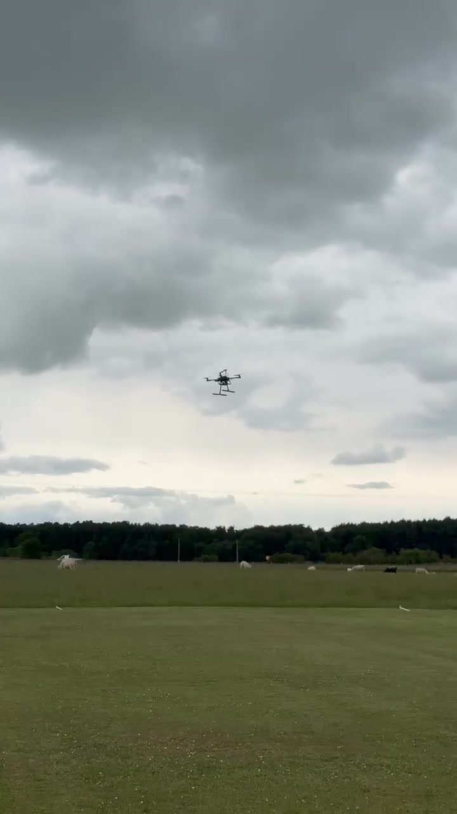
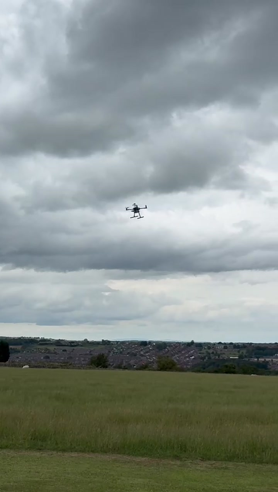
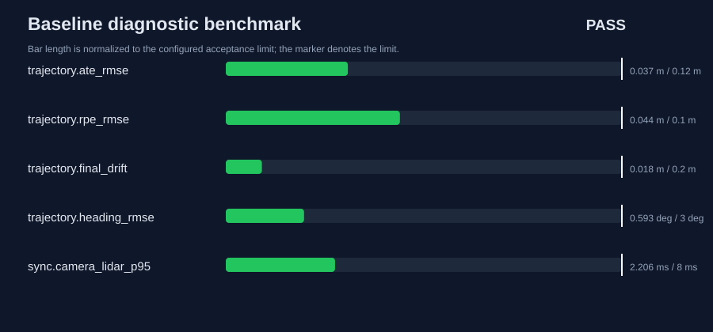
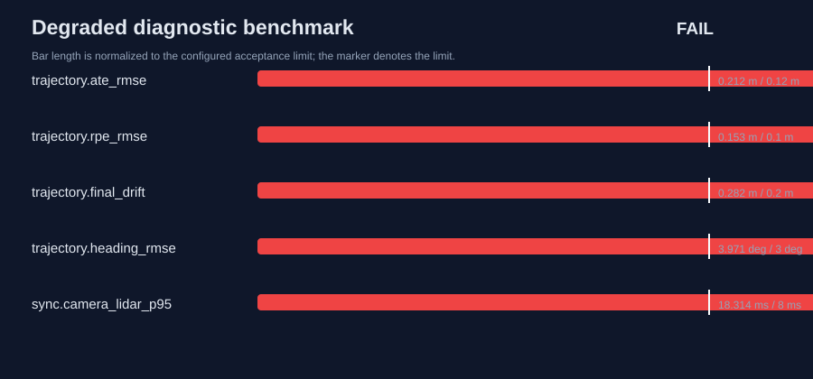

# Computer Vision and Autonomous Systems Research Portfolio

[](https://github.com/Aleck-Tao/computer-vision-autonomous-systems-portfolio/actions/workflows/reproducibility.yml)
[](LICENSE)

I am **Yuanyuan Tao (Alec)**, an MSc Electronic Engineering candidate at Durham University. My work connects physical UAV experimentation, multimodal perception, safety-constrained mission interfaces, and reproducible sensing/diagnostic workflows.

This repository is the permanent overview for my research portfolio. It keeps the physical evidence and integrated system narrative in one place, while the specialist repositories below provide focused packages, tests, data, and CI for individual research questions.

## Research map

| Specialist repository | Research question | Reproducible evidence | Boundary |
|---|---|---|---|
| [UAV multisensor diagnostics](https://github.com/Aleck-Tao/uav-multisensor-diagnostics) | Can timing and trajectory failures be detected before a camera/LiDAR experiment is accepted? | Python package, CLI, five tests, controlled fault injection, ATE/RPE and synchronization reports | Accuracy values are synthetic benchmark results, not field-performance claims |
| [Safety-constrained UAV mission interface](https://github.com/Aleck-Tao/safety-constrained-uav-mission-interface) | How should language-level intent cross into a safety-critical UAV stack? | Typed contract, JSON Schema, fail-closed policy, threat model, seven tests | The parser is rule-based and is not presented as a trained VLA model |
| [Runtime evidence assurance for UAV telemetry](https://github.com/Aleck-Tao/runtime-safety-assurance-uav) | Can changing telemetry evidence update a bounded assurance argument and produce reproducible fallback recommendations? | Executable claim/monitor mapping, deterministic replay checks, source/data/result manifests, v0.1.0 release and six-job CI | Synthetic open-loop replay with demonstrator thresholds and a separately configured synthetic oracle; no vehicle command, recovery, or flight-safety claim |
| [UAV flight-video quality audit](https://github.com/Aleck-Tao/uav-flight-video-quality-audit) | Is released field footage usable as traceable visual evidence? | Two MP4 clips, SHA-256 manifest, 224 sampled frames, per-frame CSV, JSON and SVG | Image quality does not prove autonomous-flight success |
| [Multichannel thermal validation toolkit](https://github.com/Aleck-Tao/multichannel-thermal-validation-toolkit) | How can protocol integrity, status semantics, and channel consistency form one validation decision? | Fictional public protocol, seeded simulator, nine tests, versioned gates and reports | All data are synthetic; no commercial protocol, client data, or product specification is published |

## Integrated UAV system and physical evidence

The MSc system project connects LiDAR/stereo perception, structured mission contracts, deterministic safety checks, flight-control interfaces, and post-flight validation. Two outdoor field-test videos provide evidence that the physical platform was assembled and tested; they are deliberately not used as proof of autonomous behavior.

<p>
  
  
</p>

- [Integrated system project](projects/01-ai-agent-assisted-autonomous-uav/)
- [Field-media provenance and evidence notes](projects/01-ai-agent-assisted-autonomous-uav/docs/flight_test_evidence.md)
- [Standalone safety interface](https://github.com/Aleck-Tao/safety-constrained-uav-mission-interface)
- [Standalone real-video audit](https://github.com/Aleck-Tao/uav-flight-video-quality-audit)

## Selected reproducible results

### Multisensor diagnostic benchmark

| Scenario | Verdict | ATE RMSE | RPE RMSE | Camera–LiDAR sync p95 | Failed gates |
|---|:---:|---:|---:|---:|---:|
| Baseline | **PASS** | 0.0370 m | 0.0440 m | 2.206 ms | 0 |
| Degraded | **FAIL** | 0.2119 m | 0.1525 m | 18.314 ms | 11 |

<p>
  
  
</p>

The degraded case injects drift, disturbance, timestamp jitter, loss, reordering, and clock offset. Its expected failure demonstrates the quality gates; it is not a failed field deployment.

### Real field-video audit

The committed video pipeline decodes 224 samples at 1 Hz, measures exposure/clipping, Laplacian sharpness, and temporal luminance change, then emits per-frame CSV, provenance JSON, a report, and an SVG timeline. Two low-sharpness samples were flagged in Clip B; no widespread black-frame or highlight-clipping condition was found at the sampled instants.

### Multichannel thermal validation

The separate thermal toolkit demonstrates a status-first acquisition-to-decision workflow. Its synthetic baseline passes with a 0.3026 °C p95 channel spread and zero issues; the controlled degraded run produces a 1.1843 °C p95 spread and eight coded issues. These are simulator regression results, not hardware accuracy specifications.

## Reproduce this repository

```bash
# Multisensor benchmark
cd projects/03-slam-perception-visualization-debugging-tools
python -m pip install -r requirements.txt
python -m unittest discover -s tests -v
python -m uavdiag benchmark

# Mission-contract checks
cd ../01-ai-agent-assisted-autonomous-uav
python -m unittest discover -s tests -v

# Real-video audit
cd ../02-uav-flight-video-quality-audit
python -m pip install -r requirements.txt
python -m unittest discover -s tests -v
python -m videoaudit
```

The root [GitHub Actions workflow](.github/workflows/reproducibility.yml) runs all three paths and rejects changes when committed results cannot be regenerated.

## Evidence and disclosure policy

Every quantitative statement should be traceable to a result file and regeneration command. Simulation results and field evidence are labelled separately. Confidential dissertation logs, third-party data, commercial identifiers, proprietary communication maps, calibration algorithms, and unpublished hardware details are intentionally excluded.

- [Reviewer-oriented evidence index](PROJECTS_OVERVIEW.md)
- [PhD research-fit map](docs/research_fit_map.md)
- [Asset and provenance index](ASSETS_INDEX.md)

## Research direction

I am interested in PhD work on computer vision, multimodal perception, autonomous systems, and Vision–Language–Action research, especially where real-world deployment requires explicit validation, interpretable failure analysis, and safe interfaces between learned components and control systems. My embedded sensing work provides a complementary experimental foundation: defensible acquisition, status-aware decoding, and traceable quality decisions.

## Contact

**Yuanyuan Tao (Alec)**  
MSc Electronic Engineering Candidate, Durham University  
[yuanyuan.tao@durham.ac.uk](mailto:yuanyuan.tao@durham.ac.uk)
