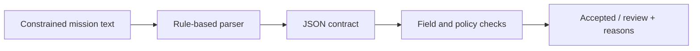

# UAV Mission Contracts and Field-Test Analysis

This project connects a mission-interface design with outdoor UAV field media and post-test analysis. The executable mission path uses a rule-based parser, a JSON contract and checks on speed, obstacle clearance and contingency flags.

## Inspect the contract

The parser extracts fields from constrained English requests. The validator checks a supplied contract against clearance limits of 0.75–5.0 m, low/normal speed, link-loss return and low-confidence stop requirements.

```bash
python scripts/mission_parser.py
python scripts/safety_checks.py
python -m unittest discover -s tests -v
```

The first script writes parsed examples to `sample_data/parsed_mission_examples.json`. The second reads the separately supplied [sample contract](sample_data/sample_mission_output.json); it does not automatically validate the first script's output. For a combined parse-and-check command and batch decisions, use the [standalone mission package](https://github.com/Aleck-Tao/safety-constrained-uav-mission-interface).

Separating the contract from its parser makes the policy inspectable. It also exposes a distinction: a required flag can be present even if the instruction was misunderstood. The keyword parser does not resolve negation, and the sample JSON is a hand-specified contract rather than a guaranteed parse of its source text.

## Interface design



A vehicle integration would then combine the accepted contract with current perception, link state and control constraints. Those interfaces are described in [system architecture](docs/system_architecture.md). A static clearance check concerns the requested value; a runtime stopping check also depends on speed, observation age and available deceleration. The [validation notes](docs/safety_and_validation.md) develop that distinction.

## Field material

<p>
  
  
</p>

The two outdoor clips document physical flight testing. Their file records and original media are in [flight_test_evidence.md](docs/flight_test_evidence.md). The [video audit](../02-uav-flight-video-quality-audit/) measures exposure and sharpness over 224 samples; the [multisensor diagnostic project](../03-slam-perception-visualization-debugging-tools/) provides a separate synthetic timing and trajectory benchmark.

The public results cover contract checks, video quality and controlled log analysis. The recordings do not establish that the mission interface controlled the flights. [Parser research notes](docs/vla_relevance.md) describe how a learned front end could be compared against the current adapter.
