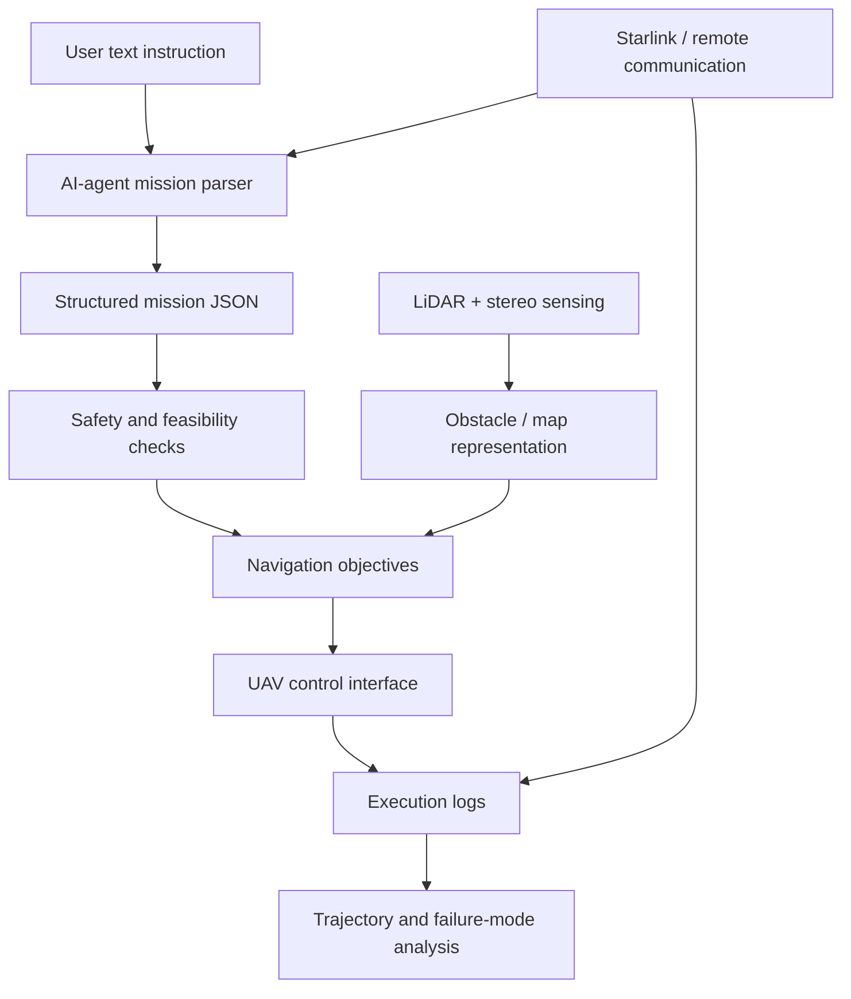

# AI-Agent-Assisted Autonomous UAV using LiDAR, Stereo Vision and Starlink

**Status:** Ongoing MSc dissertation, Durham University  
**Keywords:** UAV, LiDAR, stereo vision, SLAM-style navigation, obstacle avoidance, AI agent, natural-language instruction, Starlink communication, autonomous systems

---

## Project Overview

This project investigates an autonomous UAV system using LiDAR and stereo vision for SLAM-style navigation and obstacle avoidance. The project is being extended with an AI-agent layer that interprets natural-language mission instructions and converts them into structured mission objectives, safety constraints and autonomous-flight actions.

Starlink-enabled remote communication is included in the thesis direction to support long-range supervision, command transmission and data transfer under infrastructure-limited conditions.

The project is relevant to Vision-Language-Action research because it connects:

- visual/spatial perception,
- language-based instruction,
- autonomous decision-making,
- safety-aware action execution,
- real-time sensing,
- remote communication constraints.

---

## System Concept



---

## Example Mission Instructions

```text
Inspect the corridor, keep at least 1.5 metres away from obstacles, and return to the start point if the link becomes unstable.

Move to the target area, avoid obstacles, maintain low speed, and stop if LiDAR confidence is low.

Search the indoor test area and generate a short report of detected obstacles and risky regions.
```

---

## Repository Contents

| File | Purpose |
|---|---|
| `docs/system_architecture.md` | Architecture and data-flow description |
| `docs/vla_relevance.md` | How this project connects to VLA/autonomous-driving research |
| `docs/safety_and_validation.md` | Safety-aware design and validation plan |
| `scripts/mission_parser.py` | Representative rule-based text-to-mission parser |
| `scripts/safety_checks.py` | Example safety-check module for structured mission plans |
| `scripts/trajectory_plot_demo.py` | Synthetic trajectory visualization demo |
| `sample_data/sample_mission_commands.txt` | Example text instructions |
| `sample_data/sample_mission_output.json` | Example structured mission output |

---

## Current Development Status

This is an ongoing MSc dissertation project. The public repository intentionally avoids sharing confidential raw logs, third-party datasets or unpublished thesis material. The code provided here is representative and designed to show the research direction, system logic and reproducible development style.
