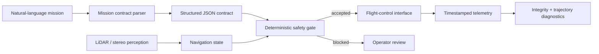

# AI-Agent-Assisted UAV: Perception, Mission Contracts and Field Testing

**Status:** ongoing MSc dissertation work at Durham University
**Research context:** UAV autonomy, LiDAR and stereo perception, mission-level language interfaces, remote communication and safety validation

This project studies how a natural-language mission can be converted into an explicit machine-readable contract, checked against deterministic safety rules, and combined with perception/navigation outputs before any action request reaches a flight-control interface.

The public repository focuses on architecture, validation interfaces and evidence that can be released safely. It does not publish confidential dissertation logs or present the rule-based language parser as a trained VLA model.

## Physical test evidence

<p>
  
  
</p>

The repository contains two outdoor UAV test clips with a combined duration of 3:43. File hashes, container metadata and the evidence boundary are documented in [`docs/flight_test_evidence.md`](docs/flight_test_evidence.md).

## System boundary



The learned/agent component is intentionally separated from the safety gate. Language parsing may evolve, but clearance limits, link-loss behavior and low-confidence stop policies remain explicit and auditable.

## Public implementation

| Artifact | What it demonstrates |
|---|---|
| `scripts/mission_parser.py` | Converts constrained English mission instructions into typed JSON fields |
| `scripts/safety_checks.py` | Blocks unsupported speed, unsafe clearance and missing fail-safe behavior |
| `sample_data/sample_mission_commands.txt` | Three mission contracts used for parser regression checks |
| `docs/system_architecture.md` | Module boundaries and data flow |
| `docs/safety_and_validation.md` | Safety constraints and experiment acceptance criteria |
| [`../03-slam-perception-visualization-debugging-tools/`](../03-slam-perception-visualization-debugging-tools/) | Reproducible timing, synchronization and trajectory quality gate |

Run the public mission path:

```bash
python scripts/mission_parser.py
python scripts/safety_checks.py
```

## What is demonstrated—and what is not

Demonstrated publicly:

- a physical UAV flown in outdoor field tests;
- explicit mission-contract and safety-validation code;
- a reproducible multi-sensor/trajectory diagnostic pipeline;
- architecture linking perception, language, safety, control and post-flight validation.

Not claimed by the public evidence:

- end-to-end autonomous flight in the released videos;
- measured LiDAR/stereo localization accuracy on those flights;
- a trained VLA policy or safety-certified flight stack.

This distinction is deliberate: each research claim should point to code, data, a metric or a clearly stated ongoing-work boundary.
