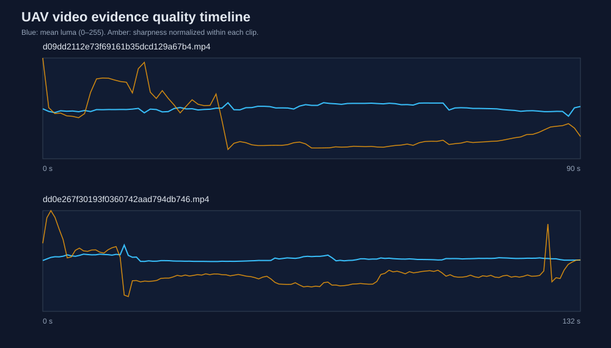

# UAV Field-Test Video Quality Audit

A reproducible computer-vision data audit for the two original outdoor UAV test videos in this repository. The pipeline decodes frames at 1 Hz and measures exposure, dark/highlight clipping, Laplacian sharpness and frame-to-frame luminance change. It produces a per-frame CSV, a provenance-rich JSON summary, a Markdown report and an SVG timeline.

This project answers a practical question before flight footage is used for perception experiments: **is the released video visually consistent enough to support downstream analysis, and where are the weak segments?**



## Released-video result

| Clip | Duration | Samples | Mean luma | Median sharpness | Low-sharpness samples | Max dark | Max clipped |
|---|---:|---:|---:|---:|---:|---:|---:|
| Clip A | 91.33 s | 91 | 128.62 | 254.5 | 0 | 4.41% | 0.55% |
| Clip B | 132.90 s | 133 | 133.41 | 216.7 | 2 | 1.94% | 1.09% |

Across both clips the audit decoded **224 real frames**. Clip B contained two within-clip low-sharpness outliers under the robust rule; neither clip showed extensive black-frame or highlight-clipping failure at the sampled instants.

## Reproduce

```bash
python -m pip install -r requirements.txt
python -m unittest discover -s tests -v
python -m videoaudit
```

The default command reads `../../Test Video/*.mp4` and writes:

- `results/frame_metrics.csv` — one row per decoded sample;
- `results/summary.json` — container metadata, aggregate metrics, byte sizes and SHA-256 hashes;
- `results/report.md` — reviewer-readable result table and interpretation;
- `results/timeline.svg` — brightness and normalized sharpness across both clips.

## Metric definitions

- **Mean luma:** Rec. 709 weighted RGB brightness on a 0–255 scale.
- **Dark fraction:** fraction of decoded pixels with luma below 16.
- **Clipped fraction:** fraction with luma above 240.
- **Sharpness:** variance of a four-neighbour discrete Laplacian; useful as a within-resolution blur proxy, not an absolute camera-quality score.
- **Temporal luma delta:** mean absolute luma difference from the preceding one-second sample.
- **Low-sharpness sample:** below Q1 - 1.5*IQR for that clip, with a fixed floor of 20.

## Evidence boundary

The audit uses real field-test footage and reports image-quality properties of those files. It does not infer flight autonomy, obstacle-avoidance success or sensor-fusion accuracy. Those require synchronized telemetry and a reference system; Project 03 provides the corresponding log-quality and trajectory-analysis interface.
